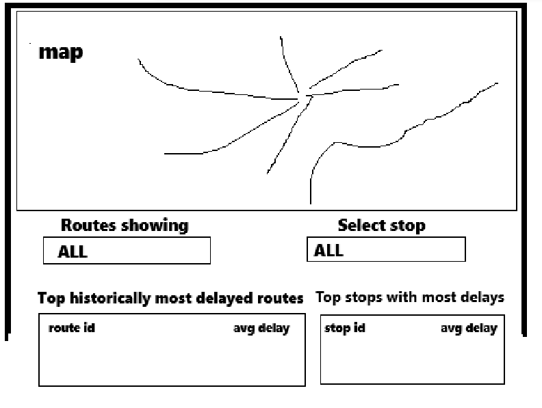
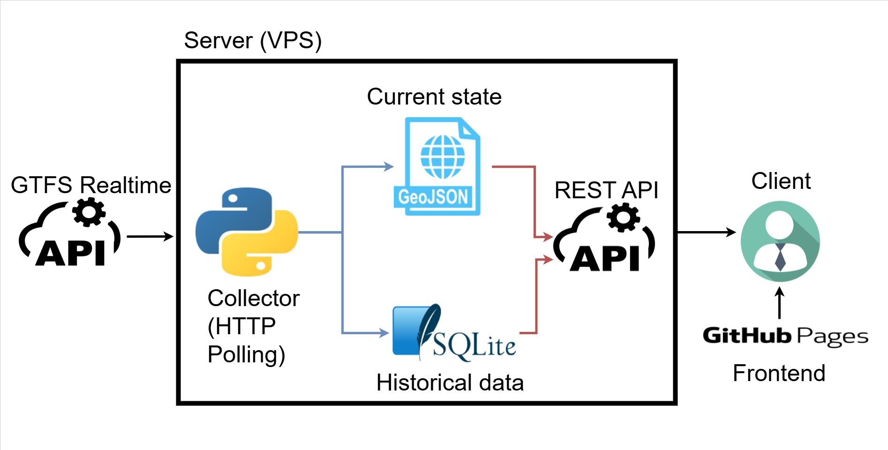
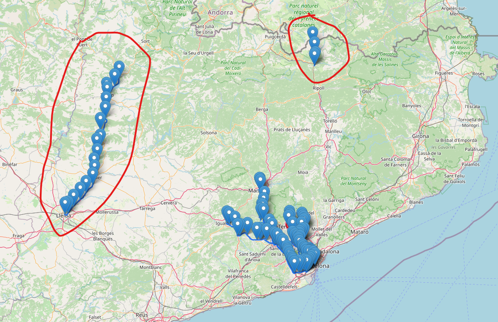

# 01/02/2026

Created a prototype just to see the components I need

# 03/02/2026

Lets make a log file to track how the project evolves

The objective is to build a data pipeline like the one I did in air_transport_statistics but this time making it scalable and truly autonomous by hosting it in the cloud, and making an API to the data so we can do lazy fetching instead of loading it all at once like we did in the previous project

Possible data source: [Eurostat](https://ec.europa.eu/eurostat/web/user-guides/data-browser/api-data-access)

Since I haven't done an API in some time, first thing I'm going to do is review some backend theory. Once I've done that, I will study what options I have to host the page the cheapest way possible. So the plan for now is:

1. Review backend theory and API's
2. Check hosting options
3. Find a data source that updates regularly and I can retrieve
4. Development

# 05/02/2026

Security concerns for my API:

1. Publish the API in HTTPS not HTTP
2. CORS
3. Rate Limiting
4. Prevent SQL Injection, validate parameters
5. Make sure to not push passwords, DB conection keys...

Possible hosts:

- Shared hosting
- VPS (managed and unmanaged)
- Platform as a Service / PaaS
- Cloud Virtual Machines / IaaS
- Dedicated Server

For my case I would prob need shared hosting, unmanaged VPS or try host in github and use
the free tiers in Render, Railway, or Fly.io. They have free plans that "sleep" when not in use.
Tomorrow I will check and decide on one of them


# 06/02/2026

Its between [hetzner](https://www.hetzner.com/cloud/), [ionos](https://www.ionos.es/servidores/vps) and [contabo](https://contabo.com/es/vps/?utm_source=google&utm_medium=cpc&utm_campaign=brand-europe-es-eur&utm_term=generic&utm_content=contabo&gad_source=1&gad_campaignid=22529964914&gbraid=0AAAAAD_Qy-cdMpRvXJEJR0SDbQ835B9pu&gclid=CjwKCAiAv5bMBhAIEiwAqP9GuCMPRzA0dNFWWV5_LPaZbfzY6a-5XA9Iu3cRu7lk-DWj2WMO0Li5whoC7ZQQAvD_BwE).
I also have to check how to get the SSL certificate for free

# 10/02/2026

I will probably choose hetzner and use it for other things like trying openclaw.
So know that I know the basics, I'm going to start the develpment in my local environment for now to get this thing going and leave the cloud for later

First thing is to find some data to work with, lets explore...

# 11/02/2026

Thinking about either: 

- GTFS data (I have to decide schedule or realtime)
- Wheather and planes opendata

Final idea, after spending the whole afternoon checking posible data sources and thinking what I could show, I decided to use GTFS schedule data from [TITSA](https://nap.transportes.gob.es/Files/Detail/1130) and visualize routes in the map and the delay for each stop, in the last few days (using the latest GTFS data) and overall (stored data from previous days).


# 12/02/2026

I thought that this [TITSA](https://nap.transportes.gob.es/Files/Detail/1130) dataset contained real data from trips operated, but I'm starting to suspect is just the planned trips, instead of the completed ones. Lets explore ```trips.txt``` with duckdb to see if it contains future trips, in that case I will know for certain are just planned trips not completed ones.

```
┌──────────┬────────────┬─────────┬────────────────┬──────────┬────────────┬──────────┬────────────────┬────────────┐
│ route_id │ service_id │ trip_id │ trip_headsign  │ shape_id │ service_id │   date   │ exception_type │ real_date  │
│  int64   │   int64    │  int64  │    varchar     │  int64   │   int64    │  int64   │     int64      │    date    │
├──────────┼────────────┼─────────┼────────────────┼──────────┼────────────┼──────────┼────────────────┼────────────┤
│       13 │          1 │       1 │ LA MATANZA (T) │        1 │          1 │ 20260810 │              1 │ 2026-08-10 │
│       13 │          1 │       2 │ LA MATANZA (T) │        1 │          1 │ 20260810 │              1 │ 2026-08-10 │
│       13 │          1 │       3 │ LA MATANZA (T) │        1 │          1 │ 20260810 │              1 │ 2026-08-10 │
│       13 │          1 │       4 │ LA MATANZA (T) │        1 │          1 │ 20260810 │              1 │ 2026-08-10 │
│       13 │          1 │       5 │ LA MATANZA (T) │        1 │          1 │ 20260810 │              1 │ 2026-08-10 │

```

Indeed, these are planned trips, not completed trips.

> GTFS Schedule contains information about routes, schedules, fares, and geographic transit details among many other features, and it is presented in simple text files. This straightforward format allows for easy creation and maintenance without relying on complex or proprietary software.

So turns out I was wrong, I have to search some other data source, either GTFS Realtime or a completely different thing. GTFS Schedule is, like its name states, for schedules/planned trips, not completed ones. 

Understanding GTFS-Realtime

- GTFS-Realtime vehicle positions are usually served as a protobuf binary (FeedMessage), not plain JSON.
- Your OpenDataSoft dataset (vehicle-positions-gtfs_realtime) does not directly expose rows like “one row per vehicle.”
- Instead, OpenDataSoft exposes a record containing a file pointer:
  - file.id
  - file.url
  - file.filename (in this case vehicleposition.pb)
- The actual vehicle data is inside that protobuf file at file.url.
So the data flow is:
1. Query metadata endpoint (JSON).
2. Extract file.url.
3. Download .pb.
4. Parse GTFS-RT protobuf.
5. Read feed.header + feed.entity[*].vehicle

### What is Protocol Buffers (Protobuf)?

* Protocol Buffers (protobuf) is a binary serialization format created by Google.
* It is used to efficiently encode structured data.
* It is:

  * Smaller than JSON
  * Faster to parse
  * Strongly typed
  * Schema-based

Unlike JSON or CSV:

* Protobuf is **not human-readable**
* It requires a `.proto` schema definition to decode

In GTFS-Realtime:

* The schema is defined in `gtfs-realtime.proto`
* The top-level message is `FeedMessage`

---

### What is a Protobuf Binary (FeedMessage)?

When a GTFS-Realtime feed is downloaded:

* The server returns raw binary bytes (`.pb` file)
* Those bytes represent a serialized `FeedMessage`
* The structure typically is:

```
FeedMessage
 ├── header
 └── entity[] (list of FeedEntity)
```

Each `entity` may contain:

* vehicle (VehiclePosition)
* trip_update (TripUpdate)
* alert (Alert)

The script parses it with:

```python
feed = gtfs_realtime_pb2.FeedMessage()
feed.ParseFromString(file_bytes)
```

This:

* Creates a new empty message object
* Decodes the binary into structured fields
* Makes it accessible as normal Python attributes

Important:

* The schema is loaded once when importing `gtfs_realtime_pb2`
* `FeedMessage()` just creates a new container object
* Creating a new instance per snapshot is correct and inexpensive

---

## About `gtfs_realtime_pb2.FeedMessage()`

* The schema is already compiled into Python classes at import time.
* `FeedMessage()` does **not reload the schema**.
* It simply creates a new empty message instance.
* `ParseFromString()` fills that instance with decoded data.
* Creating a new object for each feed download is correct and safe.
* Reusing the same object offers no meaningful performance gain.

Key idea:

* Schema = loaded once at import.
* `FeedMessage()` = new container for one snapshot.

---

## About `requests.Session()`

* `requests.Session()` enables HTTP connection reuse (connection pooling).
* Without it, each `requests.get()`:

  * Opens a new TCP connection
  * Performs TLS handshake
  * Sends request
  * Closes connection
* With a session:

  * Connections are reused
  * Polling is more efficient
  * Less latency and overhead

In this script:

* Metadata endpoint is polled
* Protobuf file is downloaded
* Repeated every few seconds

Using `Session` is correct for repeated HTTP calls.

Key idea:

* `Session` manages persistent HTTP connections.
* It improves efficiency for [polling APIs](https://medium.com/@sankalpa115/what-is-polling-b1ff70e87001) like GTFS-Realtime.

### Entities in each data source

1) vehicle position:

```
id: "0"
vehicle {
  trip {
    trip_id: "6c4bdaeb02747640fd55c10d40|6a2dc5e50b"
    schedule_relationship: SCHEDULED
  }
  position {
    latitude: 41.5613556
    longitude: 2.0175519
  }
  current_status: IN_TRANSIT_TO
  timestamp: 1770913924
  stop_id: "VP"
  vehicle {
    id: "1f2cc5fd0075"
  }
  occupancy_status: FEW_SEATS_AVAILABLE
}
```

2) trip updates:

```
id: "S|20260212|625cdae1027438|622dc6e702"
trip_update {
  trip {
    trip_id: "625cdae1027438|622dc6e702"
    start_date: "20260212"
  }
  stop_time_update {
    arrival {
      time: 1770914630
    }
    departure {
      time: 1770914660
    }
    stop_id: "SP2"
  }
  stop_time_update {
    arrival {
      time: 1770914750
    }
    departure {
      time: 1770914780
    }
    stop_id: "GO2"
  }
  stop_time_update {
    arrival {
      time: 1770914855
    }
    departure {
      time: 1770914885
    }
    stop_id: "EU2"
  }
  stop_time_update {
    arrival {
      time: 1770914960
    }
    departure {
      time: 1770914990
    }
    stop_id: "IC2"
  }
  stop_time_update {
    arrival {
      time: 1770915080
    }
    departure {
      time: 1770915110
    }
    stop_id: "MG2"
  }
  stop_time_update {
    arrival {
      time: 1770915230
    }
    departure {
      time: 1770915230
    }
    stop_id: "PE3"
  }
  timestamp: 1770914630
}

```

3) service alerts

```
id: "OBSERVATIONS_M0123_IC"
alert {
  active_period {
    start: 1770861700
    end: 1770948000
  }
  informed_entity {
    trip {
      trip_id: "625cdae1027438|632dc6e101"
      start_date: "20260212"
    }
    stop_id: "IC"
  }
  cause: UNKNOWN_CAUSE
  effect: UNKNOWN_EFFECT
  header_text {
    translation {
      text: "Enllaç amb autobús amb destinació Igualada"
    }
  }
}
```

### Similar project

I realized, maybe there is already a project that takes this data to do something similar, after searching a little I came across with [geotren](https://geotren.fgc.cat/) is made by FGC (the train company that provides the GTFS data) and it shows in real time where the trains are in a map and the stops. My idea would be to do something similar but adding the historic of delays, or some filters.

What this page does is:

- Poll https://geotren.fgc.cat/tracker/trens.geojson every ~4 seconds
- Render points on Google Maps markers
- Load static line geometry from GeoJSON files
- No obvious WebSocket/SSE push in client code

[GTFS Scheduled](https://dadesobertes.fgc.cat/explore/dataset/gtfs_zip/table/) and [line dimension](https://dadesobertes.fgc.cat/explore/dataset/lineas-red-fgc/table/)


# 13/02/2026

- Whats the difference between the geojson and GTFS data?
- Can I query the geojson indefinitely

After asking the AI:

- GTFS Static is scheduled data (routes, stops, trips, timetables) in .txt files.
- GTFS-Realtime is live operational updates (vehicle positions, delays, alerts) in protobuf (.pb) format.
- GeoJSON is just a geospatial JSON format used to draw things on maps (points/lines/polygons).

So in GeoTren-like systems, they often do:
- backend ingests GTFS-RT (protobuf),
- backend transforms it into simpler GeoJSON for the browser,
- browser polls that GeoJSON and renders markers quickly.

About querying trens.geojson “without restrictions”:
- Technically it may be publicly reachable with no auth.
- Legally/operationally, that does not mean unrestricted use.
- You still must respect:
  - provider terms/license,
  - fair-use/rate limits (even if not documented),
  - attribution/redistribution rules,
  - no abusive polling/scraping.

In conclusion, im going to use the GTFS-Realtime to build my own GeoJSON or whatever other method I come up with. Lets not use their geojson.

Okay, so I'm going to use GTFS-Realtime, lets check out the GTFS Scheduled data.

Lucky for us, is exactly the same as the GTFS data from TITSA. So we have the planned trips for this year.

[Data definition](https://gtfs.org/documentation/realtime/reference/) for vehicle position, trip updates and service alerts.

So the final idea is:



- web page with:
  - A map with the trains in real time and the stops (like the one in geotrain) 
    - If you click in a train it shows you info in real time, historic delay data and number of service alerts from that route
    - Also 
    - The same with the stops
  - Filters for route and stops showing in the map
    - Filter to select what routes display
    - Filter that takes you to a stop, if you click it, the map goes to that stop
  - Historical data about most delayed routes and stops with most delays and average time of that delays. Or other data. But the main point is to show aggregated historical data.

To obtain delay data we need to compare GTFS Scheduled with GTFS Realtime data.

Next day think about the architecture and how we are going to run this.

# 14/02/2026




Architecture idea (similar to GeoTren, but using GTFS-Realtime as the source):

- A **collector process** polls the GTFS-Realtime feeds every few seconds (protobuf), parses them, and materializes the *latest* state into a `vehicles.geojson` snapshot on disk.
  - Writing a single snapshot file keeps the realtime path cheap for the map (no DB query per refresh).
  - The snapshot should be written atomically (write to `*.tmp` and rename) so the API never serves a half-written file.
- The same collector also stores **historical observations** into a database (initially SQLite).
  - The frontend loads this historical/aggregate data once on page load (or on demand), instead of re-querying it every few seconds.
  - This reduces read/write contention and avoids “DB as a realtime cache”.
  - If using SQLite, enable **WAL mode** so reads can proceed while the collector is writing.
- The backend exposes two endpoints:
  - `GET /api/vehicles.geojson` -> serves the latest snapshot for realtime map updates.
  - `GET /api/stats` (or similar) -> serves historical/aggregate data from the database.

Frontend hosting: serve the static UI with GitHub Pages, and host the collector + API on a VPS (CORS + HTTPS required). That keeps the frontend deployment simple while the backend can run continuously.

# 17-18-19-20/02/2026

We have the architecture, we can start developing the plan I have in mind is:

1. Start developing the collector locally, first really understand how the data looks and how I'm going to process and transform it. Then code it and test. This is the main part.
2. Once I have that, buy the VPS and try it there
3. Make the frontend and API.

## Starting STEP 1

The following protocol buffer data types are used to describe feed elements:

message: Complex type\
enum: List of fixed values

This is the structure of GTFS Realtime:

```
FeedMessage
  FeedHeader
    Incrementality

  FeedEntity
    TripUpdate
      TripDescriptor
        ScheduleRelationship
      VehicleDescriptor
        WheelchairAccessible
      StopTimeUpdate
        StopTimeEvent
        ScheduleRelationship
        StopTimeProperties
      TripProperties

    VehiclePosition
      TripDescriptor
        ScheduleRelationship
        ModifiedTripSelector
      VehicleDescriptor
        WheelchairAccessible
      Position
      VehicleStopStatus
      CongestionLevel
      OccupancyStatus
      CarriageDetails

    Alert
      TimeRange
      EntitySelector
        TripDescriptor
          ScheduleRelationship
      Cause
      Effect
      TranslatedString
        Translation
      SeverityLevel

    Shape

    Stop
      WheelchairBoarding

    TripModifications
      Modification
        ReplacementStop

```

As we can see, we have six types of feed entities, in this case we only care about FeedEntity, VehiclePosition and Alert because these are the ones that are provided to us.

After learning about the realtime data, the final idea is this:

### 1) To create the Geoson we only need the last data we retrieve


### 2) For historical data, create the following table:

```
┌─────────┬──────────┬─────────┬───────────────┬─────────────────────┬───────────────────┬─────────────────┬─────────────────────┐
│ trip_id │ route_id │ stop_id │ stop_sequence │   arrival_planned   │    arrival_real   │ arrival_delay   │   event_timestamp   │
│  varchar  │  varchar   │  varchar  │     int64     │      timestamp      │     timestamp     │     int64       │      timestamp      │
├─────────┼──────────┼─────────┼───────────────┼─────────────────────┼───────────────────┼─────────────────┼─────────────────────┤

```

**VehiclePosition = “Where is the vehicle right now and what stop is it associated with.”**

It typically updates **very frequently** (every 1–30 seconds, depends on agency).

What it holds (in practice):

* `position.lat/lon`: current GPS
* `timestamp`: when that GPS/status was measured (Unix UTC)
* `trip.trip_id`: what trip the system thinks it’s serving (sometimes missing or wrong)
* `stop_id` + `current_status`: where it is relative to *a stop*

  * `IN_TRANSIT_TO`: traveling to `stop_id` (the next stop)
  * `INCOMING_AT`: very close, about to arrive at `stop_id`
  * `STOPPED_AT`: currently stopped at `stop_id`

**Important limitation:** VehiclePosition usually **does not give you actual arrival/departure times**. It gives you a state snapshot.

#### Can you derive “actual arrival/departure” from VehiclePosition?

Yes, but it’s approximate:

* **arrival_time_actual(stop)** ≈ first time you observe `current_status = STOPPED_AT` for that `stop_id`
* **departure_time_actual(stop)** ≈ first time after that where status changes to `IN_TRANSIT_TO` (and stop_id becomes next stop) or STOPPED_AT disappears

But this is noisy because:

* updates may skip states (you might never see `INCOMING_AT`)
* sampling frequency affects precision
* `stop_id` may be “next stop” not “current stop” depending on agency interpretation if `current_stop_sequence` is missing
* vehicles can dwell, reverse, lose GPS, etc.

So: **VehiclePosition is best for maps and “where is it now.”** Not ideal as your primary punctuality truth.

---

**TripUpdate = “For this trip, here are arrival/departure times (predicted and sometimes actual) for stops.”**

It usually updates **less frequently than VehiclePosition**, but it’s the right feed for stop timing.

#### Are these “actual” or “predicted”?

GTFS-RT allows both, but many agencies **do not explicitly label actual vs predicted**. The usual behavior is:

* For stops in the future: `time` is a prediction
* For a stop that just happened: `time` may become “actual” (sometimes uncertainty becomes 0, but not always provided)
* Some feeds keep updating past stops; others drop past stops quickly

So for analytics you treat TripUpdate times as **best available estimate**, and if you need strict “actual arrival,” you’ll only be certain if the feed provider clearly makes them measured values (rarely explicit).

---

#### **TripUpdate** as main comparison to `stop_times.txt`.

Because `stop_times` is stop-level schedule, and TripUpdate is stop-level RT timing.

* Important, `stop_times` times are service day times:
  * static stop_times are “service-day times” like `25:10:00`
  * RT gives absolute epoch times, so you must map planned times onto a real date/time range for the same service day.

```
For times occurring after midnight on the service day, enter the time as a value greater than 24:00:00 in HH:MM:SS.
```

To compare with RT epoch:

1. determine the **service date** (e.g., from TripUpdate `start_date = 20260212`, or from your own “service day” logic)
2. determine the agency timezone (from `agency.agency_timezone`)
3. compute:

   * `planned_arrival_epoch = epoch(service_date at 00:00 in agency_tz) + seconds(arrival_time)`
   * same for departure

Then:

* `arrival_delay_sec = realtime_arrival_epoch - planned_arrival_epoch`

### 3) Show current alerts somehow


### 4) Edge cases to keep into account: IMPORTANT, ALL INFORMATION BELOW IS NOT FINAL/CONFIRMED, LETS DO EXPERIMENTS TO SEE HOW THE DATA BEHAVES AND THEN COME BACK TO THIS AND DEFINE COLLECTOR RULES DEFINITELY 

There’s no single universal behavior — GTFS-RT feeds are produced by agency-specific systems, and in edge cases they do whatever their ops software can represent. But there are *common patterns*.

#### What can happen to a trip/vehicle during incidents

##### 1) VehiclePosition stops updating (most common)

**What you see**

* The trip/vehicle disappears from VehiclePosition entirely, or
* It keeps appearing but `timestamp` stops advancing (stale), or
* It keeps appearing with the *same coordinates* for a long time

**Why**

* GPS/device offline, radio dead zone, backend outage, vehicle swapped, etc.

**Collector rule**

* Treat VehiclePosition as **stale** if `now - vehicle.timestamp > X` (X like 120–300s depending on update frequency).

---

##### 2) TripUpdate continues but VehiclePosition disappears, or viceversa

**What you see**

* No vehicle updates, but TripUpdate still publishes stop predictions.
* The contrary

**Why**

* Predictions are generated from schedule + last known delay or control center, while GPS feed is down.
* Prediction module fails

**Collector rule**

* Keep ingesting both data sources.
* Track freshness separately for each data source.

---

##### 3) Trip is canceled: may disappear OR be explicitly marked

**Two patterns**

1. **Proper cancel:** TripUpdate appears with `trip.schedule_relationship = CANCELED` (best case)
2. **Silent cancel:** TripUpdate disappears (and maybe vehicle disappears too)

**Collector rule**

* For our case, we do not care. We store the historical data up until is not canceled, or if the trip was never made the data won't appear in the realtime.z

---

# 20/02/2026 Experiments to really understand the data

Before we continue with edge cases and such, let's do an experiment to see how often the data updates and if the joins are right, so we have the bases to start developing the collection algorithm

First of all, turns out the pb url from the API is always the same, to check updates we need to check the header timestamp from the protobuff. So the real realtime data sources would be:

- [vehicle positions](https://dadesobertes.fgc.cat/api/explore/v2.1/catalog/datasets/vehicle-positions-gtfs_realtime/files/d286964db2d107ecdb1344bf02f7b27b)
- [trip updates](https://dadesobertes.fgc.cat/api/explore/v2.1/catalog/datasets/trip-updates-gtfs_realtime/files/735985017f62fd33b2fe46e31ce53829)
- [service alerts](https://dadesobertes.fgc.cat/api/explore/v2.1/catalog/datasets/alerts-gtfs_realtime/files/02f92ddc6d2712788903e54468542936)

First experiment, check how often this data sources update.

```
[2026-02-20T18:33:54.213777+00:00] Test finished for vehicle_positions
Unique header timestamps seen: 11
Average update time: 109.71s
Update intervals counted: 10


[2026-02-20T18:34:18.631229+00:00] Test finished for service_alerts
Unique header timestamps seen: 12
Average update time: 107.70s
Update intervals counted: 11


[2026-02-20T18:34:46.840042+00:00] Test finished for trip_updates
Unique header timestamps seen: 12
Average update time: 105.38s
Update intervals counted: 11
```

Conclusion, all data sources get updated more or less at the same time (usually with +-5 seconds difference from one another), and get updated every 100~115 seconds.

Now, how does vehicle position and trip updates update with respect of each other. Do stops stop appearing in trip updates once the trip leaves the stop, or maybe they stay for a little while and then dissapear? In the second case how long does it take for a stop to dissapear? 

# 22-23/02/2026 Lingering test

Programming lingering test 

My first idea was calculating the time it took to the stops to dissapear, but is easier to interpret and more useful in out case to calculte how many snapshots does it take for the stop to dissapear.

The problem I've run into, how do we know if the two sources (trips and vehicles) are sincronized (data refers to the same moment in time). One detail that could be useful, trips timestamp is ~60 seconds ahead of vehicles timestamp if syncronized.

After experimenting with the data, I came to this conclusions:

- Data is not really real-time, it has a delay of around two minutes (for vehicles)
- Normally, as soon as the vehicle arrives at the stop, the prediction times in trips for that stop are deleted. But sometimes the prediction stays
- The only way to now if trips and vehicles are synced is by comparing the header timestamp
- Even if they are synced, they could not be updated properly. For example, prediction times in trip dissapearing before the vehicle changes state to STOPPED_AT
- It's likely the system won't show all stops properly, even skipping entire stops
- There can be trips with no vehicles, in my experience this only happens in two cases, when the trip is about ~5 or so of leaving and when the trip ends, the final stop stays longer in trips
- INCOMING_AT state never shows up
- Real Example of trip predicions beign deleted before its supossed to + skipping stops (last one) + trip with no vehicle:
```
((.venv) ) jose@pc:~/scalable-data-pipeline/GTFS-Realtime/tests$ python my_test.py
gtfs_realtime_version: "1.0"
timestamp: 1771882503

id: "S|20260223|6c4bdae302747640fd55c10d40|6c2dc5e60b"
trip_update {
  trip {
    trip_id: "6c4bdae302747640fd55c10d40|6c2dc5e60b"
    start_date: "20260223"
  }
  stop_time_update {
    arrival {
      time: 1771882464
    }
    departure {
      time: 1771882494
    }
    stop_id: "EP1"
  }
  stop_time_update {
    arrival {
      time: 1771882564
    }
    departure {
      time: 1771882564
    }
    stop_id: "TB1"
  }
  timestamp: 1771882464
}

--------------------
id: "8"
vehicle {
  trip {
    trip_id: "6c4bdae302747640fd55c10d40|6c2dc5e60b"
    schedule_relationship: SCHEDULED
  }
  position {
    latitude: 41.4036064
    longitude: 2.14261818
  }
  current_status: IN_TRANSIT_TO
  timestamp: 1771882444
  stop_id: "EP"
  vehicle {
    id: "1f2cc3fd0270"
  }
  occupancy_status: FEW_SEATS_AVAILABLE
}

--------------------
((.venv) ) jose@pc:~/scalable-data-pipeline/GTFS-Realtime/tests$ python my_test.py
gtfs_realtime_version: "1.0"
timestamp: 1771882623

id: "S|20260223|6c4bdae302747640fd55c10d40|6c2dc5e60b"
trip_update {
  trip {
    trip_id: "6c4bdae302747640fd55c10d40|6c2dc5e60b"
    start_date: "20260223"
  }
  stop_time_update {
    arrival {
      time: 1771882553
    }
    departure {
      time: 1771882553
    }
    stop_id: "TB1"
  }
  timestamp: 1771882553
}

--------------------
--------------------
```

Does timestamps in trip predictions change as the trip is beign done?
Because if they doesnt, we dont really need to check vehicles for delays.

After following a trip and storing its trace in [trace](./GTFS-Realtime/tests/trace.txt) we can see that timestamps DO change as the trip advances. This means that, to compare planned vs real times we should use the last timestamp available in trips.

And now thinking about it, even though timestamps change, we don't need to compare it with vehicles, we can just check, when a stop dissapears, we use the previous snapshot as the real arrival/departure time.


# 24/02/2026 Start programming the collector

Remember, we already have the architecture (#14/02/2026) and plan (#17-18-19-20/02/2026). Now, with all this information, we can finally start programming the data collector

If we remember the architecture, the collector does two things:

1. Create the geojson (or other format, depending on how I choose to show the map)
2. Populate historic delays table

**IMPORTANT**: GTFS-Scheduled also updates daily, so once a day we need to download it to have the latest data. Real update frequency/times are not known. So I think it is a good idea to make a script that every 2-3 hours or so downloads the data and checks if it has been updated. If it is stores the new data and keeps a record of the time. Hopefully after some days we can find a pattern and query exactly when we now the data is updated. Also ¿Maybe there are times with no realtime data? ¿What happens then?

Before implementing any logic related to either of those two points, we need to build a robust system that polls the synced snapshots from both sources and is resilient to errors

# 25/02/2026

So the idea is a fault-tolerant idempotent polling collector with retry backoff and dedupe for repeated states:

- Every 100 seconds, get the current snapshots from trips and vehicles
- In case of http error, exponential backoff until fixed
- If any of the sources is not updated, retry every 5 seconds for 50 seconds
- If any of the sorces does not update after the 50 seconds retry, dedupe (skip processing and wait another 100 seconds) and log to errors table.

# 27/02/2026

[Exception Handling Of Python Requests Module](https://www.geeksforgeeks.org/python/exception-handling-of-python-requests-module/)

```
url = "https://www.gle.com/"

try:
    r = requests.get(url, timeout=1, verify=True)
    r.raise_for_status()
except requests.exceptions.HTTPError as errh:
    print("HTTP Error")
    print(errh.args[0])
except requests.exceptions.ReadTimeout as errrt:
    print("Time out")
except requests.exceptions.ConnectionError as conerr:
    print("Connection error")
except requests.exceptions.RequestException as errex:
    print("Exception request")
```
# 03/03/2026

New behaviour, If vehicles can be updated but trips dont, execute logic keeping into account that trips is not updated (we can still update positions in the geojson)

Done the structure of the collector, start the logic for creating the geojosn

# 04/03/2026

GeoJSON Format:

GeoJSON is a JSON format for encoding geographic data structures.
It’s plain JSON with a specific structure.

At the top level, a GeoJSON object must contain a "type" field. The most common types are:

- Point
- LineString
- Polygon
- MultiPoint
- MultiLineString
- MultiPolygon
- GeometryCollection
- Feature
- FeatureCollection

Coordinates are: [longitude, latitude]

A Feature wraps a geometry with properties.

```
Point:
{
  "type": "Point",
  "coordinates": [-3.7038, 40.4168]
}

Feature:
{
  "type": "Feature",
  "geometry": {
    "type": "Point",
    "coordinates": [-3.7038, 40.4168]
  },
  "properties": {
    "name": "Madrid",
    "population": 3223000
  }
}

Feature collection:
{
  "type": "FeatureCollection",
  "features": [
    {
      "type": "Feature",
      "geometry": {
        "type": "Point",
        "coordinates": [-3.7038, 40.4168]
      },
      "properties": {
        "name": "Madrid"
      }
    },
    {
      "type": "Feature",
      "geometry": {
        "type": "Point",
        "coordinates": [2.1734, 41.3851]
      },
      "properties": {
        "name": "Barcelona"
      }
    }
  ]
}
```

geotren geojson is a FeatureCollection of points with a set of properties:

```
{
  "type": "FeatureCollection",
  "features": [
    {
      "type": "Feature",
      "geometry": {
        "type": "Point",
        "coordinates": [
          2.096418387166096,
          41.562606899904665
        ]
      },
      "properties": {
        "id": "6c4bdae302747640fd55c10d40|682dc5e001",
        "lin": "S2",
        "nc": "682dc5e001",
        "dir": "A",
        "origen": "PC",
        "desti": "PN",
        "properes_parades": [
          {
            "parada": "PN"
          }
        ],
        "estacionat_a": "NO",
        "en_hora": true,
        "material": "112.00",
        "tipus_unitat": "112",
        "ut": "1f2cc5fd0271",
        "ocupacio": {
          "linia": "bv",
          "estacio": "CT",
          "estacio_codi": "CT",
          "factor": null,
          "dt": "2026-03-04 00:11:26.934639+01:00",
          "m1": {
            "tipus_cotxe": "m1",
            "persones": 4,
            "massa": null,
            "percent": 5,
            "tram": "1"
          },
          "mi": {
            "tipus_cotxe": "mi",
            "persones": 4,
            "massa": null,
            "percent": 5,
            "tram": "1"
          },
          "ri": {
            "tipus_cotxe": "ri",
            "persones": 4,
            "massa": null,
            "percent": 5,
            "tram": "1"
          },
          "m2": {
            "tipus_cotxe": "m2",
            "persones": 4,
            "massa": null,
            "percent": 5,
            "tram": "1"
          }
        }
      }
    },
    {
      "type": "Feature",
      "geometry": {
        "type": "Point",
        "coordinates": [
          2.033020965041496,
          41.52936016375969
        ]
      },
      "properties": {
        "id": "6c4bdae302747640fd55c10d40|6a2dc2e307",
        "lin": "S1",
        "nc": "6a2dc2e307",
        "dir": "A",
        "origen": "PC",
        "desti": "NA",
        "properes_parades": [
          {
            "parada": "TR"
          },
          {
            "parada": "VP"
          },
          {
            "parada": "EN"
          },
          {
            "parada": "NA"
          }
        ],
        "estacionat_a": null,
        "en_hora": true,
        "material": "113.00",
        "tipus_unitat": "113",
        "ut": "1f2cc4fd0273",
        "ocupacio": null
      }
    },
    ...
  ]
}
```

Geotren uses google maps API

To add a [google map](https://developers.google.com/maps/documentation/javascript/add-google-map) to your page, however is not fully free (check details).

- Google Maps JavaScript API requires an API key and a billing-enabled Google Cloud project.
- You usually get a monthly free credit/quota, but after that usage is paid (pricing depends on map loads and APIs used).
- Even within free quota, you must follow Google Maps Platform Terms (attribution, usage limits, etc.).

I'm going to use Leaflet + OpenStreetMap because its the most common open source approach.

Since this is a really simple project with very lightweight computations that is barely going to have users, I'm going to keep it simple and avoid over-engineering by doing a single-container app.

So the action plan is:
1) Move the depelopment to docker
2) Finish the architecture details (orchestration? monitoring? fault-tolerant?)
3) Code all of it

# 05/03/2026

Studying docker theory

# 06/03/2026

Moving the development to docker

# 08/03/2026

For now, I'm going to assume that if the snapshots updates, all entities inside the snapshot also update. Also ignore alerts for now.

Okay so using Leaflet + OpenStreetMap, I only need the coordinates and a text with information. So I can just use the same format that geotren uses for the geojson.

Also try to find a way of limiting the calls to openmap. But that for later, now focus on how to convert the gtfs to JSON (I realized it doesnt have to be geojson, just JSON in good for my use case because I dont need GIS compatibility).

So the idea to show the trains and stops markers is a JSON with all the markers information. 

- Some preparations beforehand:

Basically load all GTFS-Scheduled data we need (stop_times, trips, routes) every X hours in case anything updates (in memory for fast joins). We can do this after the collector execution when is sleeping waiting for the next snapshot.

Also every snapshot join trips and vehicles feed by trip id, so each vehicle has the arrival information.

For trains I want to show:
- Line
- Origin
- Destination
- Next stop
- Occupancy status
- Schedule state
- Position

So a JSON like this for each train:
```
{
route_short_name
origin
destination
next stop
occupancy status
Schedule state
Position
}
```

To obtain vehicles JSON, for every vehicle position:

1. Every time we detect a new vehicle position (using trip_id) we use trip_id to join with GTFS-Scheduled stop_times.txt to obtain origin and destination stops, store it and use it every time we create the JSON, delete information when the trip ends.
2. Use GTFS-Scheduled trips.txt to obtain route_short_name joining by trip_id, again this is only done once and stored until the trip ends
3. next stop is the stop_id field and occupancy status occupancy_status in vehicles position
4. Schedule state: possibles states "on time" and "late". To calculate, check every trip updates snapshot and Scheduled stop_times.txt and compare the arrivals time for the current stop in vehicles. stop_times.txt is the scheduled arrival time, so if the difference with trips arrival time is equal or greater than 10 minutes, status is "late".


And for every stop:

Trains that started their travel, how long until they get to the stop

```
{
stop_id
[
  {
    route_short_name
    destination
    time_until_arrival
  },
  {
    route_short_name
    destination
    time_until_arrival
  }
  ...
]
}
```

To obtain this JSON, we need to:

0. route_short_name and destination were previously calculated and stored
1. For every trip in trips feed, calculate the time until vehicle reaches every stop, arrival time minus creation timestamp from feed


# 11/03/2026

Today:
First create the GTFS-Scheduled collector script that will be executed once a day or so, inside that script generate a JSON with all the stops coordinates, so it loads the first time the web page is loaded and shows all the stops

Once we have that, create the JSONs for the realtime information

Possible improvement for load_gtfs_shceduled, for trips only load today's trips

# 13/03/2026

Lets do a full prototype, only showing stops and vehicles in the map and the info I already got from vehicles (everything except schedule status)

1. Create a volume to put output jsons from both collectors
2. Finish programming collector prototype so it returns a json for every vehicle
3. Progam prototype API and frontend and see if it works using github pages

```
docker run -v collector_outputs:/usr/src/collector/outputs --mount type=bind,src="$(pwd)"/apps_prototype/collector,dst=/usr/src/collector/collector_src -ti -d gtf
s-collector
```

Step one and two done, just for one vehicle

Besides stops, make gtfs schedule return the shapes of the tracks

Turns out Scheduled stops and shapes show somes routes that are not in geotren

For now leave them there, delete if necessary later.

Only the API left and final frontend

# 14/03/2026

Since for some reason I cant pull images from docker hub using my home network, I have to create the images by hand

```
docker run --name gtfs-api-container -p 8000:8000 -v collector_outputs:/collector_outputs gtfs-api
```

# 15/03/2026

Lets make a frontend and see if it works with github pages

After experimenting, it is clear that if we compare our data with https://geotren.fgc.cat/ ours is 2-3 minutes late. Like we said in (22-23/02/2026 Lingering test).

# 16/03/2026

Now lets make stops data (arrival times for upcoming trips)

That is done, I have all the information I need, next step is calculating delays and storing them on a sqlite database

# 17/03/2026


# Concepts I've been learning with this project 

- cosas de backend, API's, seguridad API's
- GTFS Scheduled and GTFS Realtime format and ingest ways
- Protobuf
- HTTP Polling, short polling, long polling
- WebSockets, Server-Sent Events (SSE)
- Idempotent
- Retry Backoff
- Developing with docker
- Monorepo, microservices architectures, microservices desing patterns


# Possible improvements

- DevOps during development: CI/CD, Testing