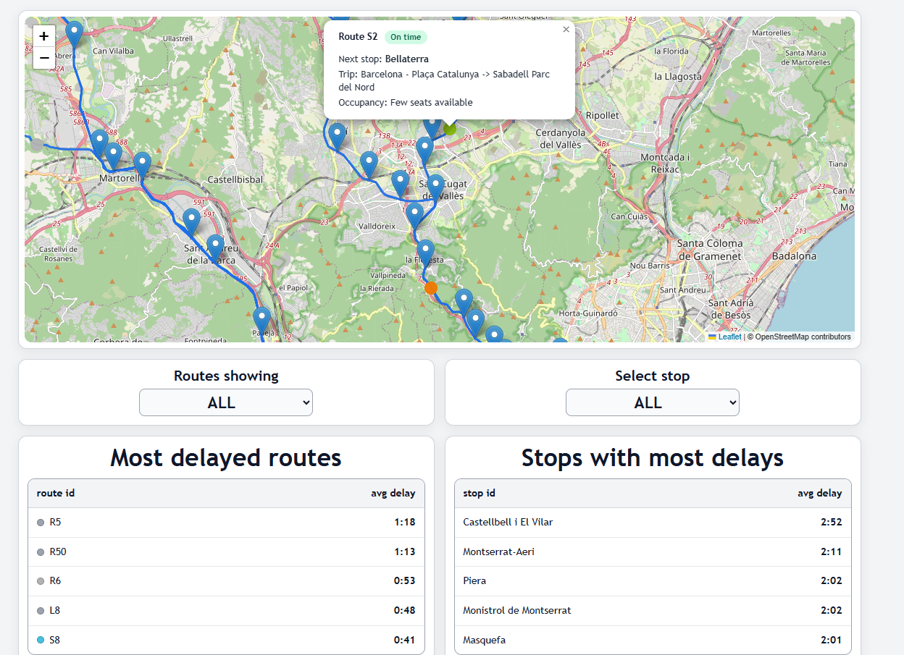

# FGC Transit Realtime Dashboard
A small GTFS-Realtime dashboard for **FGC** (Ferrocarrils de la Generalitat de Catalunya). It shows:
- a Leaflet map with vehicle markers + stop popups (upcoming arrivals)
- two panels with the most delayed routes/stops (based on a SQLite history table)
The system is split into:
- **collector** (`apps/collector`): polls GTFS-Realtime feeds, writes JSON snapshots + stores delays in SQLite
- **api** (`apps/api`): serves the latest JSON snapshots + aggregated “top delays” endpoints
- **frontend** (`apps/frontend`): static UI that calls the API



## Run locally (Docker Compose)
Requirements: Docker + Docker Compose.
From the repo root:
```bash
docker compose up --build
```
Then open the dashboard at:
- http://localhost:8001
(For reference, the API is at http://localhost:8000)
To stop:
docker compose down
GitHub Pages demo
A fully static demo (no backend) lives in docs/ and is what gets deployed to GitHub Pages.
It replays a finite set of pre-recorded snapshots to mimic realtime updates.

