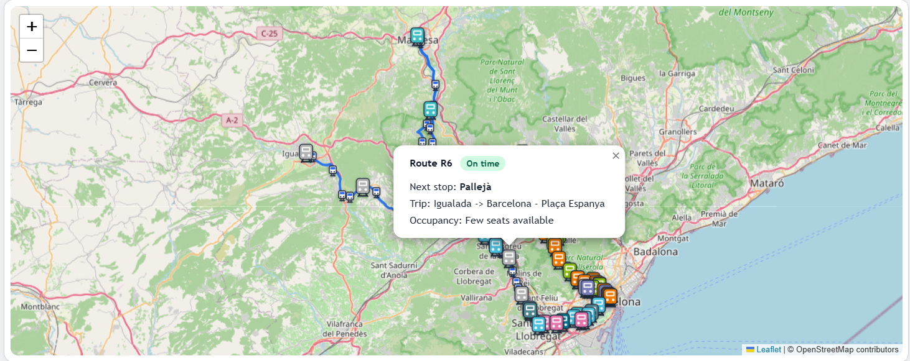

# FGC Transit Realtime Dashboard

Realtime dashboard for **FGC** (Ferrocarrils de la Generalitat de Catalunya)



It shows:
- Map with vehicles and stops
- The status of the vehicles (occupancy, schedule status, next stop...)
- Two panels showing the routes and stops with the highest average delay

The project is meant to run in a server and follows this architecture


## [Dashboard](https://joseantonio002.github.io/FGC-transit-realtime-dashboard/)

Since I do not own a server at the moment, a fully static demo (no backend) lives in docs/ and is what gets deployed to GitHub Pages.
It replays a finite set of pre-recorded snapshots to mimic realtime updates.

To see the project actually running go to [install](#install-and-run-locally)


## Install and run locally
Requirements: Docker + Docker Compose.
From the repo root:
```bash
docker compose up --build
```
Then open the dashboard at:
- http://localhost:8001
(For reference, the API is at http://localhost:8000)
To stop:
docker compose down


